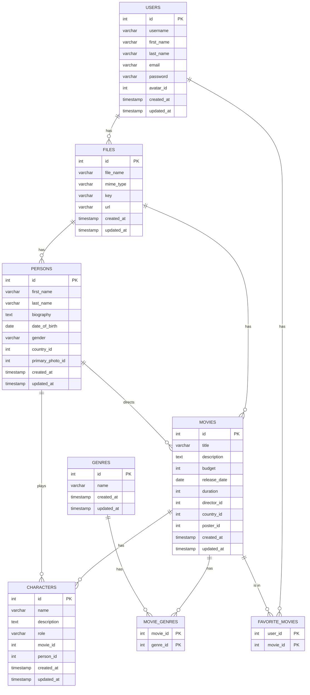

# Movies Knex

This project is a simplified database for a movie application using Knex.js and Node.js. It includes the database structure, ER diagram, and JavaScript queries.

## ER Diagram




## Project structure

movies_knex/   
├── README.md  
├── knexfile.js  
├── migrations/  
│   ├── 20230723123456_create_users.js  
│   ├── 20230723123457_create_files.js  
│   ├── 20230723123458_create_movies.js  
│   ├── 20230723123459_create_characters.js  
│   ├── 20230723123500_create_persons.js  
│   ├── 20230723123501_create_genres.js  
│   ├── 20230723123502_create_movie_genres.js  
│   ├── 20230723123503_create_favorite_movies.js  
├── seeds/  
│   ├── seed_users.js  
│   ├── seed_files.js  
│   ├── seed_movies.js  
│   ├── seed_characters.js  
│   ├── seed_persons.js  
│   ├── seed_genres.js  
│   ├── seed_movie_genres.js  
│   ├── seed_favorite_movies.js  
├── models/  
│   ├── User.js  
│   ├── File.js  
│   ├── Movie.js  
│   ├── Character.js  
│   ├── Person.js  
│   ├── Genre.js  
│   ├── MovieGenre.js  
│   ├── FavoriteMovie.js  
├── queries/  
│   ├── selectQueries.js  
├── package.json  
└── node_modules/  

## Setup

1. Install dependencies:
     ```sh
     npm install
     ```

2. Create and configure the database:
   ```sh
   npm run create-db
     ```
3. Perform migrations to create tables:
   ```sh
   npx knex migrate:latest
     ```
4. Fill the database with test data:
     ```sh
     npx knex seed:run
     ```


## Usage

To run JavaScript queries, use:
```sh
node queries/selectQueries.js
```